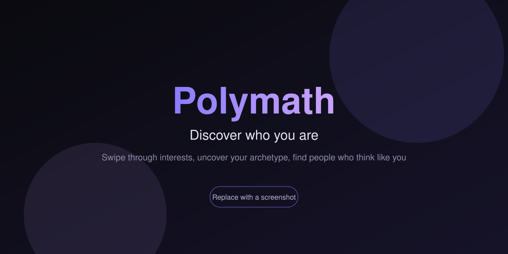

# Polymath

<!--
  HERO IMAGE: assets/hero.svg is a placeholder. To swap in a real screenshot,
  drop your image at assets/hero.png (a 1280x640 shot works well) and change
  the src below from assets/hero.svg to assets/hero.png. Nothing else to edit.
-->
<p align="center">
  
</p>

Discover who you are. Polymath is a self discovery web app where you swipe through interests, uncover your archetype, and find people who think like you. It runs as an installable Progressive Web App and works on mobile and desktop.

Live idea in one line: swipe cards, get scored across a set of dimensions, see your archetype, then connect with intellectual soulmates.

## 🎯 Overview

Polymath turns a simple swipe deck into a personality portrait. You react to a deck of interest cards, the app scores your choices across several dimensions, and it computes one of ten archetypes for you, such as The Renaissance Soul, The Creative Explorer, or The Lone Wolf. A radar chart visualises your profile, and a social layer lets you match with people whose profiles resonate with yours.

## ✨ Features

**Discovery and profiling**
* A swipe deck of interest cards, with a quick five card onboarding for first time visitors
* Scoring across dimensions that computes one of ten archetypes
* A radar chart that visualises your profile at a glance

**Social**
* Accounts and profiles backed by a Butterbase cloud backend
* Matching so you can discover and connect with people who think like you
* Shareable profiles encoded in a link, plus a Wrapped style card you can export as an image

**Engagement**
* Streaks and badges that reward returning
* Personalised recommendations, currently served from a curated fallback set

**Progressive Web App**
* Installable, works offline, with a service worker and web manifest
* Mobile first interface with sound and haptic touches

## 🛠️ Tech Stack

* **Framework**: React 18 with Vite
* **Styling**: Tailwind CSS, with lucide-react icons
* **Backend**: Butterbase SDK for auth, profiles, and matches
* **Image export**: html2canvas for shareable cards
* **State**: local storage for your session, with the backend for social data

## 🚀 Getting Started

```bash
git clone https://github.com/panoskokmotos/hobbies-game.git
cd hobbies-game
npm install
npm run dev
```

Then open the local URL Vite prints, usually `http://localhost:5173`.

To build for production:

```bash
npm run build
npm run preview
```

## 🔑 Configuration

Copy `.env.example` to `.env` if you want to point the app at your own Butterbase project. Both values are optional, and sensible defaults are baked into `src/lib/butterbase.js`.

```
VITE_BUTTERBASE_APP_ID=
VITE_BUTTERBASE_API_URL=
```

A note on AI recommendations: there is intentionally no client side LLM key. Vite inlines any `VITE_` variable into the browser bundle, so a paid API key behind that prefix would ship to every visitor. Until recommendations are served through a backend proxy that holds the key server side, the app returns a curated fallback set.

## 📂 Project Structure

```
hobbies-game/
├── index.html            App entry and social meta tags
├── src/
│   ├── screens/          Swipe, Archetype, Matches, Profile, Discover, and more
│   ├── components/       Swipe deck, radar chart, modals, navigation
│   ├── data/             Cards, archetypes, categories, badges
│   ├── lib/              Butterbase client, storage, helpers, api
│   └── hooks/            Swipe deck, sound, auth form
├── public/               Service worker and web manifest
└── vite.config.js        Vite config
```

## 📄 License

Open source under the MIT License. See [LICENSE](LICENSE).

## 👤 Author

Panos Kokmotos, co-founder at Givelink.
Email: panos@givelink.app
Portfolio: [panoskokmotos.com](https://panoskokmotos.com)
